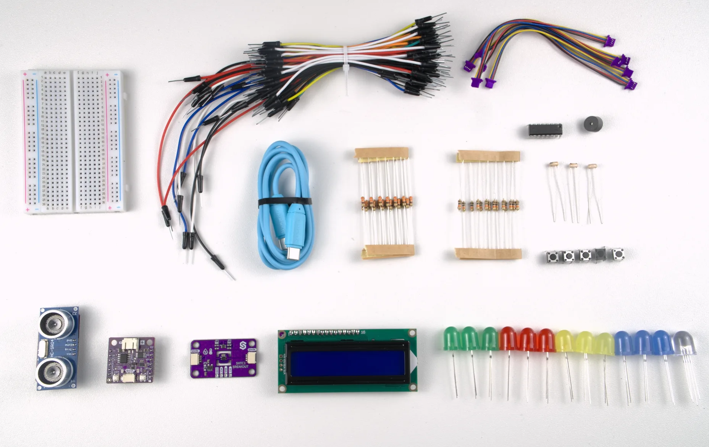

# Embedded Journey Kit - Zero to Hero: MicroPython examples

MicroPython example scripts for the [Embedded Journey Kit - Zero to Hero](https://solde.red/333371). Every example in
this repository is written to be read as much as run: each one explains what every new function does and why the
circuit behaves the way it does, so you can change things and understand what happened.

## Start from zero, become a hero

NULA means zero in Croatian. This kit is your path from absolute beginner to capable maker. Built around the NULA Mini
ESP32-C6, a breadboard-ready programmable board with Wi-Fi 6 and Bluetooth 5.3, it supports both MicroPython and
Arduino. You'll quickly move from blinking your first LED to building connected IoT devices without feeling lost or
overwhelmed.

The kit bridges two worlds: plug-and-play Qwiic modules (no soldering required) and classic breadboard components for
hands-on circuit building.

- **Qwiic ecosystem:** 16x2 LCD, ultrasonic distance sensor, and SHTC3 temperature/humidity sensor connect easily to
  the NULA Mini
- **Classic components:** Mini breadboard, LEDs, photoresistors, buzzer, shift register (74HC595), resistors, and
  jumper wires for fundamental experimentation

You get step-by-step documentation and tutorials for both MicroPython and Arduino, plus guided projects that build
practical skills:

- Blinking LEDs and button interactions
- Light sensing and LCD text displays
- Distance measurement and Wi-Fi communication
- Smart weather station, mini piano, parking sensor
- Morse code transmitter, alarm clock, traffic light simulator
- And more

Designed for STEM classrooms, workshops, and self-learners, this kit helps you move from theory to creating something
that works. Our tutorials get you started quickly while teaching you why circuits work, not just how to copy them.

Ready to start from zero?

> **Documentation and tutorials are coming soon.** Until then, every script in this repository is heavily commented and
> can be followed on its own. The `<link placeholder>` markers in the script headers are where the tutorial links will
> go.

## What's in the kit

| Component | Quantity | Notes |
| --- | --- | --- |
| NULA Mini ESP32-C6 | 1 | With male headers, breadboard ready |
| LCD Display 16x2 | 1 | Qwiic |
| [Distance Sensor HC-SR04](https://solde.red/333001) | 1 | Qwiic |
| [Temperature and Humidity Sensor SHTC3](https://solde.red/333032) | 1 | Qwiic |
| Qwiic cable, 10 cm | 5 | |
| Mini breadboard | 1 | |
| Jumper wire set for breadboard | 1 | |
| 10 mm colorful LED diode | 13 | 12 single-colour LEDs and 1 RGB LED |
| 10k photoresistor | 3 | |
| Buzzer | 1 | Passive |
| Push button | 5 | 4 used at once, in 7.2 Mini piano |
| Shift register IC | 1 | 74HC595 |
| 10k THT resistor | 15 | Voltage divider for the photoresistors, plus spares |
| 330 Ohm resistor | 25 | One in series with every LED, to limit the current |

## Getting started

### 1. Put MicroPython on the board

The NULA Mini is an ESP32-C6 board, so it runs the official **ESP32_GENERIC_C6** build of MicroPython. Download the
latest `.bin` from [micropython.org/download/ESP32_GENERIC_C6](https://micropython.org/download/ESP32_GENERIC_C6/).
ESP32-C6 support arrived in MicroPython 1.24, so use that version or newer.

The easiest way is through **Thonny**: open *Tools -> Options -> Interpreter*, pick MicroPython (ESP32), then click
*Install or update MicroPython* and let it do the download and flashing for you.

If you prefer the command line:

```bash
pip install esptool
python -m esptool --chip esp32c6 --port /dev/ttyACM0 erase_flash
python -m esptool --chip esp32c6 --port /dev/ttyACM0 --baud 460800 write_flash 0 ESP32_GENERIC_C6-<version>.bin
```

On Windows the port looks like `COM5`, and on macOS like `/dev/cu.usbmodem*`.

### 2. Put the drivers on the board

The three Qwiic modules are driven by the Soldered drivers in the [`lib`](lib) folder of this repository. MicroPython
looks for imported modules in a folder called `lib` on the board itself, so they have to be on the board before those
examples will run.

**The easy way, with `mip`.** MicroPython's own package installer can fetch them straight from this repository, so
there is nothing to download by hand:

```bash
pip install mpremote
mpremote mip install github:SolderedElectronics/Soldered-NULA-Beginner-kit-MicroPython-project-examples/lib
```

That puts all four drivers into `/lib` on the board, which is exactly where the examples expect them.

**To install the examples as well**, leave the `/lib` off the end and `mip` will fetch the drivers together with all 22
example scripts, which land in `/lib/Examples` grouped by section:

```bash
mpremote mip install github:SolderedElectronics/Soldered-NULA-Beginner-kit-MicroPython-project-examples
```

**By hand instead.** In **Thonny**, open the `lib` folder in the *Files* pane, right-click it and choose *Upload to /*.
Or copy it with `mpremote` directly:

```bash
mpremote connect auto fs cp -r lib :
```

Nothing else needs installing. The `urequests` and `ntptime` modules used by the Wi-Fi examples are already built into
the standard ESP32 firmware.

### 3. Run an example

Open any `.py` file in Thonny and press *Run*. Start at `1.1_Hello_World` and work down in order: the examples build on
each other, and the later ones point back at the earlier ones instead of explaining the same thing twice.

From the command line:

```bash
mpremote connect auto run 1_Basic_Skills/1.1_Hello_World/1.1_Hello_World.py
```

To make an example start on its own every time the board powers up, copy it onto the board as `main.py`:

```bash
mpremote connect auto fs cp 1_Basic_Skills/1.2_LED_blinking/1.2_LED_blinking.py :main.py
```

## The examples

There are 22 examples across seven sections. Sections 1 to 6 each teach one new thing at a time. Section 7 combines
what you have learned into finished projects.

### 1. Basic skills

| Example | What you learn | Hardware |
| --- | --- | --- |
| [1.1 Hello World](1_Basic_Skills/1.1_Hello_World) | `print()`, talking to the console | Board only |
| [1.2 LED blinking](1_Basic_Skills/1.2_LED_blinking) | `Pin()`, `Pin.OUT`, `value()`, `time.sleep()` | LED, 330 Ohm resistor |

### 2. Inputs and outputs

| Example | What you learn | Hardware |
| --- | --- | --- |
| [2.1 Button counter](2_Inputs_and_Outputs/2.1_Button_Counter) | `Pin.IN`, `Pin.PULL_UP`, reading a button, why a raw reading is noisy | Button |
| [2.2 Button debounce](2_Inputs_and_Outputs/2.2_Button_Debounce) | `ticks_ms()`, `ticks_diff()`, debouncing, toggling a state | Button, LED, 330 Ohm resistor |
| [2.3 Photoresistor analog read](2_Inputs_and_Outputs/2.3_Photoresistor_Analog_Read) | `ADC()`, `read()`, attenuation, the 12-bit range | Photoresistor, 10k resistor |
| [2.4 Buzzer beep](2_Inputs_and_Outputs/2.4_Buzzer_Beep) | `PWM()`, `freq()`, `duty_u16()`, lists, `for` loops | Buzzer |

### 3. Ultrasonic distance sensor

| Example | What you learn | Hardware |
| --- | --- | --- |
| [3.1 Measuring distance](3_Ultrasonic_Distance_Sensor/3.1_Measuring_Distance) | Using a driver over Qwiic, `begin()` then `takeMeasure()` | Ultrasonic sensor, Qwiic cable |
| [3.2 Distance fade LED](3_Ultrasonic_Distance_Sensor/3.2_Distance_Fade_LED) | Writing your own map function, `duty_u16()`, clamping a value | Ultrasonic sensor, LED, 330 Ohm resistor |

### 4. LCD display

| Example | What you learn | Hardware |
| --- | --- | --- |
| [4.1 Print message](4_LCD_Display/4.1_Print_Message) | `begin()`, `backlight()`, `setCursor()`, `print()`, rows and columns | 16x2 LCD |
| [4.2 Auto scroll text](4_LCD_Display/4.2_Auto_Scroll_Text) | `scrollDisplayLeft()`, animating text with a pause | 16x2 LCD |

### 5. Temperature sensor SHTC3

| Example | What you learn | Hardware |
| --- | --- | --- |
| [5.1 Reading temperature and humidity](5_Temperature_Sensor_SHTC3/5.1_Reading_Temperature_and_Humidity) | `I2C()` over Qwiic, `sample()` before reading, timing with `ticks_ms()` | SHTC3 sensor |

### 6. Wi-Fi

| Example | What you learn | Hardware |
| --- | --- | --- |
| [6.1 Connecting and getting data](6_Wi-Fi/6.1_Connecting_and_Getting_Data) | `network.WLAN()`, `isconnected()`, `urequests.get()` | Board only |
| [6.2 Wi-Fi LED control](6_Wi-Fi/6.2_Wi-Fi_LED_Control) | Building a server from a `socket`, routing, a little HTML and JavaScript | LED, 330 Ohm resistor |
| [6.3 Sending data](6_Wi-Fi/6.3_Sending_Data) | `urequests.post()`, headers, sending your own data to a server | Board only |

Sections 6.1, 6.3 and the Wi-Fi projects need your network name and password filled in at the top of the script. The
board connects to 2.4 GHz networks.

### 7. Projects

| Project | What it combines | Hardware |
| --- | --- | --- |
| [7.1 Smart weather station](7_Projects/7.1_Smart_Weather_Station) | SHTC3 + LCD + Wi-Fi, sending readings to a webhook | SHTC3, LCD |
| [7.2 Mini piano](7_Projects/7.2_Mini_piano) | Four buttons mapped to note frequencies | 4 buttons, buzzer |
| [7.3 Parking sensor](7_Projects/7.3_Parking_sensor) | Distance driving beep rate, non-blocking beeping | Ultrasonic sensor, buzzer, LED, 330 Ohm resistor |
| [7.4 RGB LED controller](7_Projects/7.4_RGB_LED_Controller) | One analog input driving three PWM outputs, colour mixing | Photoresistor, RGB LED, 10k resistor, 3x 330 Ohm resistor |
| [7.5 Shift register](7_Projects/7.5_Shift_Register) | Writing your own `shift_out()`, latching, binary counting, 8 outputs from 3 pins | 74HC595, 4 LEDs, 4x 330 Ohm resistor |
| [7.6 Morse code transmitter](7_Projects/7.6_Morse_code_transmitter) | `input()`, dictionaries as lookup tables, your own functions | LED, 330 Ohm resistor |
| [7.7 Alarm clock](7_Projects/7.7_Alarm_Clock) | `ntptime` over Wi-Fi, LCD, two debounced buttons, buzzer | LCD, 2 buttons, buzzer |
| [7.8 LED traffic light](7_Projects/7.8_LED_Traffic_Light) | Finite state machines, timed sequences without pausing | 3 LEDs, 3x 330 Ohm resistor |

## Pins used by each example

Every example is standalone and picks whichever pins suit it, so you will rewire between them. Use this table as a
quick reference. All numbers are the `IO` numbers printed on the board.

| Example | IO2 | IO3 | IO4 | IO5 | IO18 | IO19 |
| --- | --- | --- | --- | --- | --- | --- |
| 1.2 LED blinking | | | LED | | | |
| 2.1 Button counter | | | | | | Button |
| 2.2 Button debounce | | | LED | | | Button |
| 2.3 Photoresistor | | | | Photoresistor | | |
| 2.4 Buzzer beep | | | | Buzzer | | |
| 3.1 Measuring distance | | | | | | |
| 3.2 Distance fade LED | LED | | | | | |
| 6.2 Wi-Fi LED control | | | LED | | | |
| 7.2 Mini piano | Button 1 | Button 2 | Button 3 | Button 4 | Buzzer | |
| 7.3 Parking sensor | Buzzer | | | LED | | |
| 7.4 RGB LED controller | Red | Green | Blue | Photoresistor | | |
| 7.5 Shift register | Data | Latch | Clock | | | |
| 7.6 Morse code | LED | | | | | |
| 7.7 Alarm clock | Hour button | Minute button | Buzzer | | | |
| 7.8 Traffic light | Red | Orange | Green | | | |

The three Qwiic modules - the LCD, the ultrasonic distance sensor and the SHTC3 - do not appear in the table because
they all share the same I2C bus, which on the NULA Mini is **IO6 (SDA)** and **IO7 (SCL)**. Chain them together with the
Qwiic cables and no pin configuration is needed, which is why example 3.1 claims no GPIO pins at all.

Buttons use the **internal pull-up resistors** of the board, switched on with `Pin.PULL_UP`. That means no resistor is
needed on the breadboard: wire one side of the button to the pin and the other straight to **GND**. It also means the
readings are the other way around from what you might expect, which is called active low: a pin reads **1 (high) while
its button is released** and **0 (low) while it is pressed**.

Every LED needs its **own 330 Ohm resistor** in series with it, which limits the current through it. Without one the
LED draws more current than either it or the pin is built for, and both can be damaged. The RGB LED counts as three
LEDs here, so it takes three resistors, one per colour channel.

The photoresistor examples need a **10k resistor** as well. A photoresistor changes its resistance with light but the
board can only measure a voltage, and pairing it with a fixed resistor turns that changing resistance into a changing
voltage. This arrangement is called a voltage divider.

## The lib folder

| Driver | Used by | Provides |
| --- | --- | --- |
| [`lib/LCD.py`](lib/LCD.py) | sections 4, 7.1, 7.7 | `LCD_I2C`, the 16x2 Qwiic display |
| [`lib/SHTC3.py`](lib/SHTC3.py) | sections 5, 7.1 | `SHTC3`, the temperature and humidity sensor |
| [`lib/UltrasonicSensor.py`](lib/UltrasonicSensor.py) | sections 3, 7.3 | `UltrasonicSensor`, the distance sensor |
| [`lib/Qwiic.py`](lib/Qwiic.py) | the drivers above | shared Qwiic helper the other drivers build on |

Install them with `mip`, or copy the folder across by hand, as described in step 2 above. If an example stops with
`ImportError: no module named 'LCD'`, the drivers are not on the board, or they have landed somewhere other than
`/lib`.

The same drivers are also published on their own, one module per sensor, in the
[Soldered MicroPython Modules](https://github.com/SolderedElectronics/Soldered-MicroPython-Modules) repository, if you
want just one of them for a project of your own.

Sections 1, 2 and 6 use nothing but the modules built into MicroPython, so they run on a freshly flashed board.

## Arduino

The same 22 examples exist for the Arduino IDE, with matching numbering and matching pins, in the
[Arduino examples repository](https://github.com/SolderedElectronics/Soldered-NULA-Beginner-kit-Arduino-project-examples).

## Need help?

- Product page: [solde.red/333371](https://solde.red/333371)
- Contact Soldered: [soldered.com/contact](https://soldered.com/contact)
- Found a mistake in an example? Open an issue or a pull request, both are welcome.
